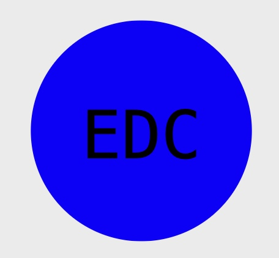

# Object-oriented-Programming-Logo-Maker

## Description:
A user enters their choice inputs in command line to generate a logo design.

## Table of Contents:
- [Usage](#Usage)
- [Install](#Install)
- [What I Learned](#What-I-Learned)
- [Screenshot](#Screeshot)
- [Walkthrough Video](#Walkthrough-Video)
- [Author](#Author)
- [Acknowledgments](#Acknowledgments)

## Usage
```md
AS a freelance web developer
I WANT to generate a simple logo for my projects
SO THAT I don't have to pay a graphic designer
```
## Install
1. Node.js [Version 20.11.0 LTS] https://nodejs.org/en/
2. Jest [Version 29.7] https://jestjs.io/docs/getting-started
3. Inquirer.js [Version 8.2.4](https://www.npmjs.com/package/inquirer/v/8.2.4)

## What I Learned
- To build a Node.js command-line application that takes in user input to generate a logo and save it as an SVG file or HTML. The application prompts the user to select a color and shape, a text for the logo, and saves the generated SVG to a .svg file. 

## Screenshot
The following picture shows application example of logo:


## Walkthrough Video:
Here is a <a href="https://drive.google.com/file/d/1tDCwJYoW2IlsRZp58e2KCShYssqWBdxI/view" target="_blank">Link</a> to a video walkthrough that demonstrates the functionality of my application.

## Author
Here is my <a href="https://github.com/arielRvaldez/Object-oriented-Programming-Challenge" target="_blank">Github Repo Link</a>.

## Acknowledgements
- MDN References https://developer.mozilla.org/en-US/docs/Web/SVG/Tutorial/Basic_Shapes
- Wikipedia https://en.wikipedia.org/wiki/SVG
- Stackoverflow https://stackoverflow.com/questions/17466707/how-to-apply-a-color-to-a-svg-text-element